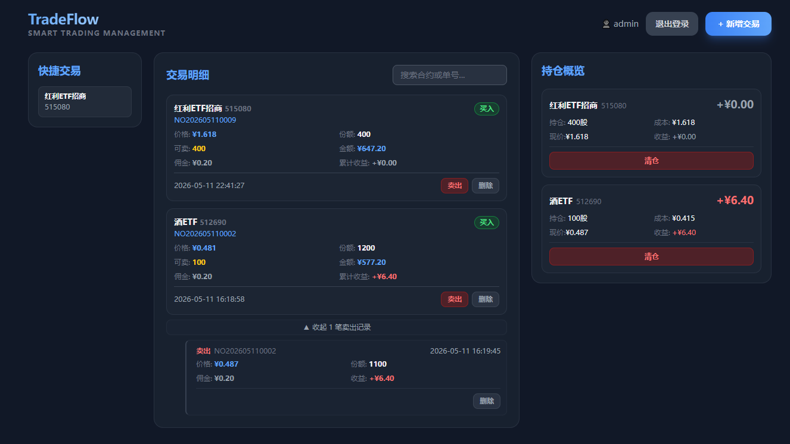

# TradeFlow — 网格交易记录

<p align="center">
  
  
  
  
  
</p>

## 项目简介

TradeFlow 是一个专为网格交易设计的记录工具，帮助用户追踪每笔网格交易的盈利情况。

**核心价值**：
- 📊 **精准记录**：详细记录每笔买入和卖出操作
- 💰 **盈利追踪**：自动计算每笔网格交易的单笔收益和累计收益
- 📈 **成本摊薄**：通过网格高抛低吸，实时显示持仓成本降低过程
- ✅ **数据准确**：全量重算机制，确保盈亏数据准确无误

**技术特点**：
- ✅ **无后端服务**：直接使用 Supabase（PostgreSQL + Auto API）
- ✅ **自动部署**：GitHub Actions 自动构建并部署到 GitHub Pages
- ✅ **网格专用**：基于买入单号的卖出关联，完美适配网格交易策略
- ✅ **盈利清晰**：每笔卖出自动计算收益，买入记录累加总收益
- ✅ **快捷交易**：标签化常用合约，一键快速发起网格操作
- ✅ **登录保护**：简单的用户名密码登录，保护交易数据安全

---

## 📸 界面预览



---

## 🚀 快速开始

### 前置条件

1. **创建 Supabase 项目**
   - 访问 [https://app.supabase.com](https://app.supabase.com)
   - 创建新项目，获取 Project URL 和 Anon Key

2. **执行数据库 Schema**
   - 在 Supabase Dashboard → SQL Editor
   - 复制 `supabase-schema.sql` 全部内容并执行

### 本地开发

```bash
# 1. 配置环境变量
cp .env.example .env
# 编辑 .env 文件，填入你的 Supabase 配置

# 2. 安装依赖
npm install

# 3. 启动开发服务器
npm run dev
```

访问 http://localhost:5173，使用默认账号登录：
- **用户名**: `admin`
- **密码**: `admin`

### 生产部署

推送代码到 GitHub 后，GitHub Actions 会自动构建并部署到 GitHub Pages。

**配置步骤**：
1. 在仓库 Settings → Secrets and variables → Actions 中添加：
   - `VITE_SUPABASE_URL` = 你的 Supabase URL
   - `VITE_SUPABASE_ANON_KEY` = 你的 Supabase Anon Key
2. 在 Settings → Pages 中启用 GitHub Actions
3. 推送代码到 main 分支

部署完成后访问：`https://username.github.io/repository-name`

---

## 目录结构

```
PythonProject/
├── src/                        # Vue 3 前端源码
│   ├── App.vue                 # 根组件（含登录逻辑）
│   ├── api/stock.js            # Supabase Client 封装
│   ├── stores/stock.js         # Pinia store（含认证状态）
│   └── components/             # Vue 组件
│       ├── LoginPage.vue       # 登录页面
│       ├── TradeList.vue       # 交易明细列表
│       ├── PositionList.vue    # 持仓概览
│       ├── TradeModal.vue      # 新增交易弹窗
│       ├── SellModal.vue       # 卖出操作弹窗
│       ├── ConfirmModal.vue    # 确认对话框
│       └── Toast.vue           # 消息提示
├── public/
│   └── favicon.svg             # 网站图标
├── .env.example                # 环境变量模板
├── package.json                # 项目依赖
├── supabase-schema.sql         # PostgreSQL 数据库 schema
└── .github/workflows/deploy.yml # GitHub Actions 配置
```

---

## 核心功能

### 网格交易记录

#### 买入操作
- 自动生成买入单号（格式：`NO + YYYYMMDD + 4位流水号`）
- 记录合约代码、名称、价格、份额、手续费
- 作为网格交易的基准，后续卖出将关联此单号

#### 卖出操作（网格核心）
- **必须关联买入单号**，明确这笔卖出对应哪次买入
- 支持分批卖出（一笔买入可对应多笔卖出）
- **自动计算单笔收益**：`(卖出价 - 买入价) × 份额 - 手续费`
- 实时更新买入记录的累计收益，清晰展示网格盈利

#### 删除操作
- 买入记录有卖出关联时禁止删除（需先删除所有卖出记录）
- 删除卖出记录自动恢复买入记录的可卖份额和收益
- 触发器自动重新计算持仓和盈亏

### 盈利计算（网格交易核心）

- **单笔收益**：每次卖出时自动计算该笔网格的盈利
- **累计收益**：买入记录累加所有关联卖出的收益，展示总盈利
- **成本摊薄**：通过高抛低吸，持仓成本持续降低
- **计算公式**：
  - 单笔收益 = `(卖出价 - 买入价) × 份额 - 手续费`
  - 持仓成本 = `(买入总金额 - 卖出总金额) / 持仓份额`
- 每次交易变动自动触发全量重算，确保盈利数据准确

### 快捷交易

- 标签化常用网格标的，快速发起交易
- 自动记录买入过的合约，生成快捷入口
- 点击标签自动填充合约信息（代码、名称）
- 支持删除不需要的标签
- 预留实时价格字段，后续可扩展行情功能

### 登录认证

- 简单的用户名密码登录（默认：admin/admin）
- 登录状态保存到 localStorage
- 刷新页面保持登录状态
- 右上角显示用户名和退出按钮

---

**祝你使用愉快！** 🎉
